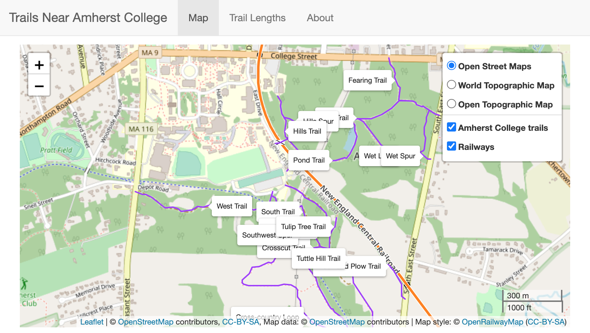
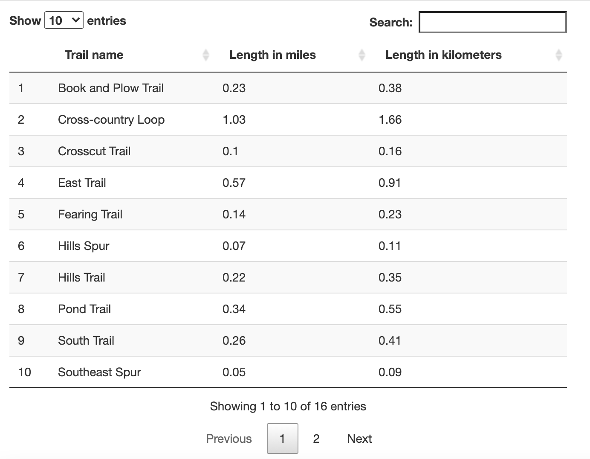
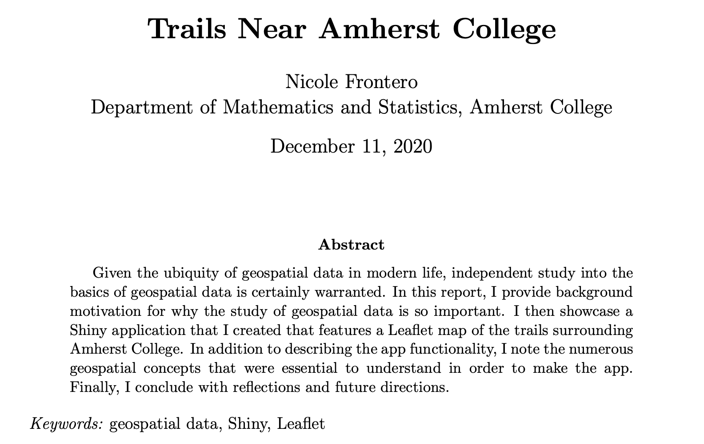

# Trails Near Amherst College

For my capstone statistics project as a Statistics major at Amherst College, I taught myself how to work with geospatial data and ultimately created an interactive map of the trails near Amherst College.  

The major deliverables from this project were:

1) A **Shiny app** that contains a Leaflet map of the trails surrounding Amherst College (accessible at https://nfrontero20.shinyapps.io/leaflet/)

  
   

2) A **report** that accompanies the app (which can be found [here](https://github.com/Amherst-STAT495F20/STAT495F20-project-Frontero/blob/main/report/report.pdf))

  

3) An Rda (R data object) named [app-objects.rda](https://github.com/Amherst-STAT495F20/STAT495F20-project-Frontero/blob/main/shiny/app-objects.rda) that contains four layers of geospatial data: `amherst_college_trails`, `bike_trails`, `elevation_contours`, and `trail_lengths`.  

## Navigating the repository

The repository contains all code that was used to generate the Shiny app, as well as the report.  An explanation of the files used to create the Shiny app is as follows:

* ["data-raw"](https://github.com/Amherst-STAT495F20/STAT495F20-project-Frontero/tree/main/data-raw) folder contains the raw data
* [create-renamed-data.rmd](https://github.com/Amherst-STAT495F20/STAT495F20-project-Frontero/blob/main/create-renamed-data.Rmd) contains code that creates renamed copies of the raw data files and saves them in the ["data"](https://github.com/Amherst-STAT495F20/STAT495F20-project-Frontero/tree/main/data) folder
* [create-objects.rmd](https://github.com/Amherst-STAT495F20/STAT495F20-project-Frontero/blob/main/create-objects.Rmd) saves the data layers needed for the Leaflet map to an Rdata file named [app-objects.rda](https://github.com/Amherst-STAT495F20/STAT495F20-project-Frontero/blob/main/shiny/app-objects.rda) in the ["shiny"](https://github.com/Amherst-STAT495F20/STAT495F20-project-Frontero/tree/main/shiny) folder 
* ["shiny"](https://github.com/Amherst-STAT495F20/STAT495F20-project-Frontero/tree/main/shiny) folder contains all of the code needed to run the Shiny app, including: 
  - [ui.R](https://github.com/Amherst-STAT495F20/STAT495F20-project-Frontero/blob/main/shiny/ui.R)
  - [server.R](https://github.com/Amherst-STAT495F20/STAT495F20-project-Frontero/blob/main/shiny/server.R)
  - [Global.R](https://github.com/Amherst-STAT495F20/STAT495F20-project-Frontero/blob/main/shiny/Global.R), a special R file that allows for the Rdata file to be read in, giving the app access to all needed data
  - [app-objects.rda](https://github.com/Amherst-STAT495F20/STAT495F20-project-Frontero/blob/main/shiny/app-objects.rda)
