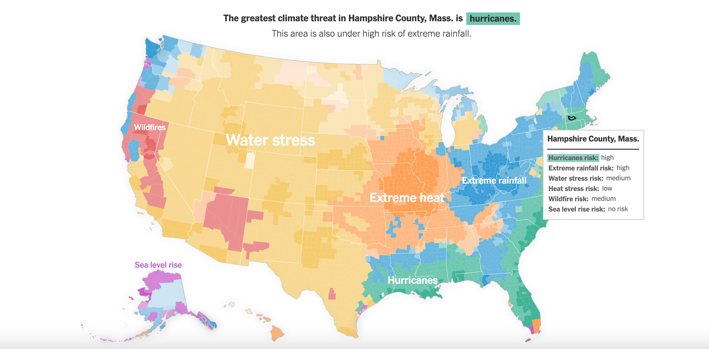
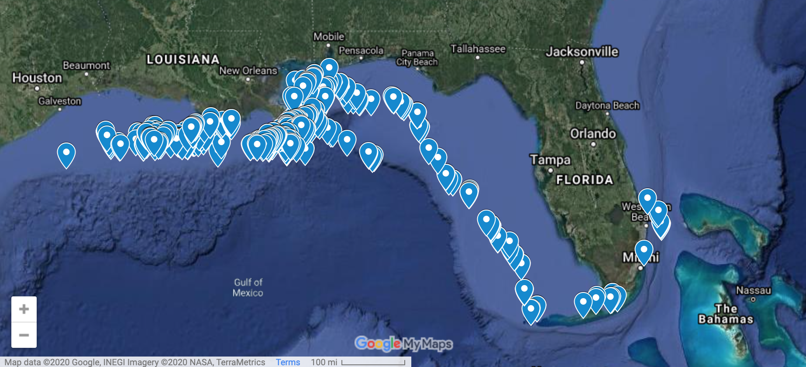
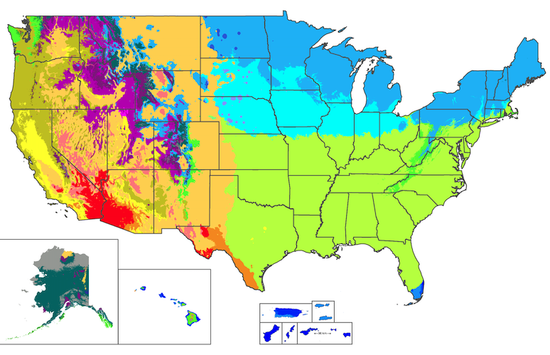
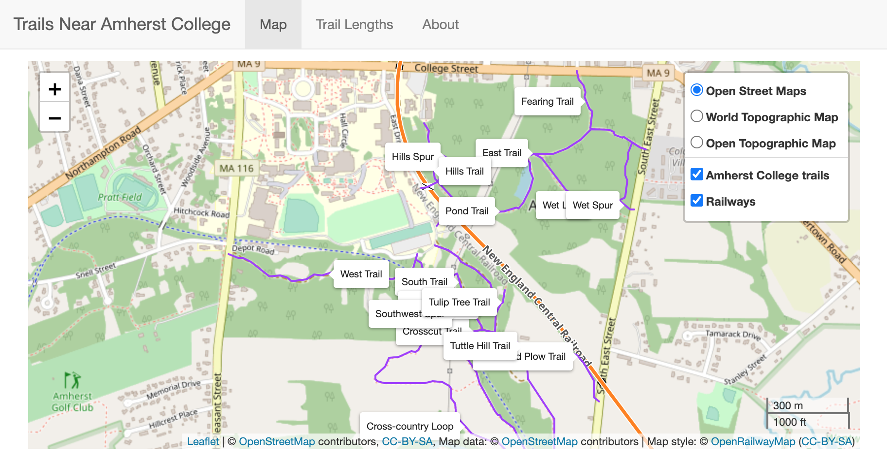
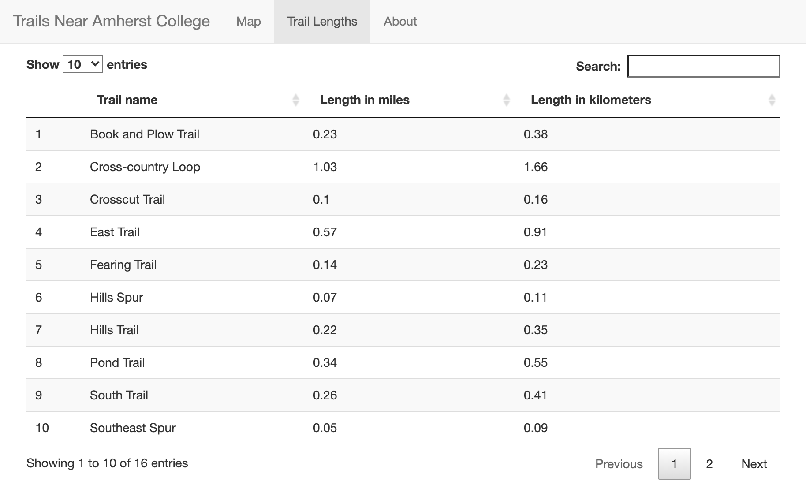
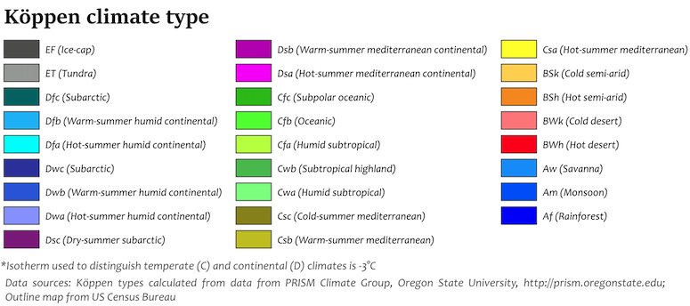

```{r setup, include = FALSE}
library(tidyverse)
library(mosaic)
library(mdsr)
library(knitr)
library(kableExtra)
library(ggplot2)
library(sf)
library(citr)
```

# Introduction

## Motivation

As a statistics and data science student, I have been trained in how to extract information from data and how to present data in a comprehensible manner. I have been exposed to parametric and nonparametric statistical methods, static and dynamic methods for data visualization, and computer science concepts, and yet, in part because the fields of statistics, mathematics, and computer science are so broad, I have not worked with geospatial data to date.

I have long had an interest in maps and globes. When I was in elementary school, I used to enjoy spinning the globe that we had at home.  I would close my eyes as the globe spun, and I would use my finger to slow down the globe's movement, acting as the brakes on the globe's movement. Once the globe had stopped, I would try to guess the area of the world that my finger had landed upon by noticing any raised surfaces denoting mountainous regions. When I would open my eyes, I seldom had correctly guessed the location (my predictive model was rather haphazard).  Despite my lack of accuracy, I would nevertheless relish in looking closer at the given region of the globe, taking in the surrounding areas and trying to commit it to memory.  Given my longstanding interest in maps, it feels fitting that I am  dedicating my final project in [Statistics 495 - Advanced Data Analysis](https://www.amherst.edu/academiclife/departments/courses/2021F/STAT/STAT-495-2021F) to creating a map.

I have created a map of the trail systems surrounding Amherst College that is accessible via a Shiny application that can be found [here](https://nfrontero20.shinyapps.io/leaflet/).  I wish that I could have had access to a map like this during my time at Amherst College, because then I would have learned about trails that I never knew existed, and because I would have a sense of where the trails led to instead of blindly following a trail.

This report serves as the final project in Statistics 495 - Advanced Data Analysis, which is the final core curriculum course of the Statistics major at Amherst College. Additionally, this project serves as my having completed the comprehensive exam for the statistics major. Most importantly, though, this project is a presentation of the statistics and data science acumen that I have accrued throughout my time as a statistics major at Amherst College.

## Overview of the report

This report begins with background overview about geospatial data, in which I define geospatial data and offer motivation into why it is worthwhile to study geospatial data.  I then showcase the Shiny app through showing images of it, describing how the app was created the geospatial concepts that I needed to understand in order to create it.  Finally, I conclude with some reflections and thoughts on future directions. 

\newpage

# Background information on working with geospatial data

## Defining geospatial data

Geospatial data and geographic information system data are closely-related types of data, but for the sake of clarity, I will explicitly state the difference between them before I get too far into this report. *Geospatial data* refers to data that has some sort of geographic component to it. This geographic component could come from having data pertaining to coordinates, ZIP code, city, etc. [@dempseyWhatDifferenceGIS2014a]. *Geographic information system* (hereafter referred to as GIS) data is a form of geospatial data in which data is stored in layers. These layers can be manipulated, analyzed, and visualized through mapping. Throughout this report, I'll use the term geospatial data, but note that GIS data is the specific type of geospatial data that I worked with.

## Common uses of geospatial data

Geospatial data is ubiquitous in modern life. To illustrate the far-reaching influences of geospatial data on modern life, I'll share a list of some of the ways in which I engage with geospatial data in a given day, in hopes that it becomes apparent the multitude of ways in which I rely upon geospatial data. 

When I first wake up in the morning, I take a look outside my window to see what the weather looks like. Regardless of what the weather is when I wake up, I like to check a weather application on my phone so that I can get a sense for what to expect the weather to be for the rest of the day. A little later on my morning, I usually check the COVID-19 cases in Massachusetts (where I live), the United States, and the entire world so that I can stay up to date on the progression of the pandemic. When trying to get information on COVID-19 cases, I tend to look at maps that have color or bubble facets to help users gauge the scale of the increase in cases in a given region. 

Around midday when I'm having lunch, I often read the news or humor myself with a funny video on YouTube, but I also may check Snapchat to see if any of my friends have graced me with an image of their lives. Sometimes when I am fumbling around with Snapchat and struggling to get to the desired page within the app, I stumble across the ["Snap Map"](https://map.snapchat.com/) page, which shows where my friends are located. I find this feature to be relatively invasive, which is why I don't share my location, but that is neither here nor there. In the afternoon, I might go for a run and when I do, I like to use the [MapMyRun](https://www.mapmyrun.com/us/) application on my phone to track my run. Also, at some point during the day, I often end up driving somewhere in the local area for some sort of errand, and oftentimes, I'll use the mobile application for [Google Maps](https://www.google.com/maps) to help get me there.

Despite having bored you with a retelling of my day, note the many ways in I engaged with geospatial data: for the weather, for navigation, for estimation of travel time, for tracking the distance and pace of my run, for staying up to date with COVID-19 cases, and even for tracking my friends. The ways in which I tend to engage with geospatial data represent only a small fraction of the myriad ways that geospatial data is integrated into our daily lives and livelihoods. Some notable industries that rely on geospatial data include telecommunications, the defense industry, urban planning and development, natural resource exploration, and others [@omnisciGeospatialCompleteIntroduction].

## Just for fun - some cool uses of geospatial data

I wanted to share two of my favorite examples of geospatial data in use. The first is the [New York Times' map of climate risk](https://www.nytimes.com/interactive/2020/09/18/opinion/wildfire-hurricane-climate.html), which allows users to toggle over every county in the United States to get a snapshot view of the severity that various climate change phenomena pose, including hurricanes, extreme rainfall, water stress, sea level rise, heat stress, and wildfires [@thompsonEveryPlaceHas2020].  

```{r, echo=FALSE, out.width="80%", fig.align = "center", fig.cap = "New York Times climate risk map"}



```

I am also a fan of the [University of Miami Shark Research Team's](https://sharkresearch.rsmas.miami.edu/) maps that [show the movements of each of the sharks](https://sharkresearch.rsmas.miami.edu/education/virtual-learning/tracking-sharks/) that they have tagged.  I  enjoy following the path of one shark in particular, a 339cm female [Tiger shark called "Olivia Eve"](https://sharkresearch.rsmas.miami.edu/education/virtual-learning/tracking-sharks/olivia-eve/), that is named after my friend Olivia.

```{r, echo=FALSE, out.width="80%", fig.align = "center", fig.cap = "Tracking the movements of Tiger shark Olivia Eve"}



```

## Why work with geospatial data? A motivating example

Geospatial data is omnipresent in daily life and is ingrained into many industries, but what about geospatial data makes it so appealing? Depending upon who you ask, you may get a different answer, but the following motivating example is intended to illustrate two particular benefits of working with geospatial data. Visualizations made with geospatial data allow us, at times, to process information in an easier method than we could if we looked at the data in tabular format. As a result, sometimes visual presentation can often lead to insights that would otherwise be more difficult to conceptualize.

Consider the following example. Someone, perhaps a friend, asks you asks you "What is the climate of the United States?". You know that there is no one simple answer to this question - after all, it's no secret that some places in the U.S. experience snow in December while other places have warm tropical breezes at the same time.

Because there are so many places in the U.S. to consider, you realize that you're going to need to be able to describe the climate of the U.S. by looking at regions that are at least the size of states, if not composed of multiple states so that you can provide a somewhat concise response to your friend.

One approach you could take to answer your friend would be to primarily consult tabular data. If you were to find a data set that listed every U.S. census-designated location and its associated [Köppen climate type](https://en.wikipedia.org/wiki/K%C3%B6ppen_climate_classification), you could consider grouping the observations by state [@wikipediaKoppenClimateClassification2020]. Then, you could identify a way to declare an overall climate type for a given state, and you could list the climate types of every state. While this approach may theoretically be possible, it is ill-advised in practice. By taking this approach, you would fail to identify that some states have multiple climate types depending upon the region of the state. Furthermore, to answer your friend, you'd be offering 50 climate types, which would likely dizzy them and leave them feeling unsatisfied with your answer.  

A preferred approach would be to make a map that shows the United States with each census-designated place color-coded by Köppen climate type, which you could then show to your friend. A benefit of the mapping approach is that you would be able to point out that certain states have multiple climate types. For example, the map below clearly indicates that Arizona has multiple climate regions, including cold desert (BWk), hot desert (BWh), hot-summer mediterranean (Csa), warm-summer mediterrannean (Csb), cold semi-arid (Bsk), hot semi-arid (Bsh), warm-summer mediterranean continental (Dsb), and hot-summer mediterranean continental (Dsa).  (See Appendix A for a legend indicating what Köppen climate type each color of the map corresponds to).

```{r, echo=FALSE, out.width="75%", fig.align = "center", fig.cap = "Köppen climate types of the U.S. (50 states, District of Columbia, and 5 inhabited U.S. territories"}



```

Creating a map would also allow for you to show your friend that the eastern half of the continguous United States has only a few climate types, while the western half has numerous climate types. You could also point out that there is a roughly horizontal line bisecting the eastern half of the United States, with land above that line having either warm-summer humid continental climate (Dfb) or hot-summer humid continental climate (Dfa), and land below the line having humid subtropical (Cfa), for the most part.

Your friend will likely be much happier that you chose to take advantage of the fact that geospatial data lends itself to mapping instead of limiting yourself to exploring geospatial data in a tabular format. As this example illustrates, mapping geospatial data allows for individuals to construct visual summaries and to have insights about patterns in the data that they may not otherwise identify.

# Shiny app: Trails Near Amherst College

Given the ubiquity of geospatial data in life and the advantages that geospatial data can provide when trying to extract meaning from data, I was interested in spending my time for my final project starting to learn about how to work with geospatial data.   

I created a Shiny app, which can be [accessed here](https://nfrontero20.shinyapps.io/leaflet/), that displays what I have learned throughout this process.  I will be discussing the functionality of the app, as well as the geospatial principles that I had to understand in order to make the app.  To aid in this explanation, I will be references images of the working application. 

## App tabs and functionality 

The application has two main tabs, "Map" and "Trail lengths," as well as a third tab with background information on the project.  

The map allows for users to select between three base layers, which are tiles obtained through providers that Leaflet supports the use of [@rstudioLeaflet].  Users can also choose to view additional layers, which are the Amherst College trails and also railways throughout the world.  The Amherst College trails are displayed with permanent labels so that a user can easily identify which trail is which.  Finally, users can zoom in and out of the app.

The second tab includes a table of the lengths of each of the Amherst College trails, listed in both miles and kilometers.  Users can search for a trail name in a search bar.  

As stated in the "About" tab of the app, my hope is, if this app was shared with members of the Amherst community, that they would find it of use by perhaps learning about the presence of trails they didn't know existed, and by having a way to quickly identify the length of the trails. 

```{r, echo=FALSE, out.width="90%", fig.align = "center", fig.cap = "Map tab from the Shiny app"}



```

```{r, echo=FALSE, out.width="90%", fig.align = "center", fig.cap = "Trail lengths tab from the Shiny app"}



```

## Behind the scenes

This app was created using methods of working with geospatial data in R.  I will provide information on the various geospatial topics that I became acquainted with in order to make this app. 

Geospatial data can be stored as either vectors or rasters, but in this project I worked only with vector data.  Vector data is geospatial data that is stored as points, lines, and polygons [@lovelaceGeocomputation2020].  The [data files](https://github.com/Amherst-STAT495F20/STAT495F20-project-Frontero/tree/main/data) that I used contained vector data in [shapefiles](https://en.wikipedia.org/wiki/Shapefile) format.  In order to access a layer of data (data that could be added to a map), four files with the same name but with different extensions are required.  The filetypes needed to work with shapefile data are .dbf, .shp, .shx, and .prj.  

I worked with three different data sets in this project. 

* **Amherst College trails:** Obtained through [Amherst College IT Department](https://www.amherst.edu/offices/it).
 
* **Bicycle trails:** Obtained through [MassGIS (Massachusetts Bureau of Geographic Information)](https://docs.digital.mass.gov/massgis).  The specific layer I utilized is the [Bicycle Trails](https://docs.digital.mass.gov/dataset/massgis-data-bicycle-trails) layer.
    
* **Elevation contours:** Obtained through the [Amherst, MA town government website web-page dedicated to GIS data and maps of the town](https://www.amherstma.gov/400/Amherst-Maps-Property-Info).  The data was downloaded using the Amherst, MA town government [app to extract topographic data](http://gis.amherstma.gov/apps/topoextract.htm) by selecting the "Elevation Contours" check box and downloading shapefiles. 

In [create-objects.rmd](https://github.com/Amherst-STAT495F20/STAT495F20-project-Frontero/blob/main/create-objects.Rmd), these data sets are read into R.  The summary that prints when these layers are read in tells us the geometry of the layers.  As was just mentioned, vector data is stored in points, lines, and polygons, and there are combinations of these that produce different vector geometries [@lovelaceGeocomputation2020].  Reading in these layers revealed that the elevation contours layer has a geometry of type `3D Line String`, and that the Amherst College trails and the bike trails layers are of geometry type `Line String`.

I utilized the `sf::st_read()` function to read in the layers.  `sf` offers quite a lot of versatility for manipulating layers, but it ended up being that I only needed to use `sf::st_read()` when working with the layers.  I would have used `sf::st_crs()` should it have proved necessary for me to reproject any of the layers.  

This brings up another key geospatial data concept: projections.  Geospatial data is used to represent the three dimensional Earth in a two dimensional space, such a computer screen or a book [@hortonModernDataScience].  However, there is no simple way to process of representing the three dimensional Earth in two dimensional space.  Consequently, there are many types of projections that differ in various ways. 

After the data was processed and all objects needed for the app were saved to [app-objects.rda](https://github.com/Amherst-STAT495F20/STAT495F20-project-Frontero/blob/main/shiny/app-objects.rda), the data was accessed via [Global.R](https://github.com/Amherst-STAT495F20/STAT495F20-project-Frontero/blob/main/shiny/Global.R).  Placing the objects in Global.R allowed for [ui.R](https://github.com/Amherst-STAT495F20/STAT495F20-project-Frontero/blob/main/shiny/ui.R) and [server.R](https://github.com/Amherst-STAT495F20/STAT495F20-project-Frontero/blob/main/shiny/server.R) to have access to the objects because Global.R is a special file that allows for the server and ui files to access any data that is in Global.R without explicitly reading any data into the ui and server files [@raessAwesomenessThatGlobal2018]. 

\newpage

# Conclusion

In this report I provided motivation for working with geospatial data, commenting on the ubiquity of geospatial data in daily life.  I offered a motivating example of how geospatial data helps people construct visual summaries and reach new insights about data that they likely wouldn't have arrived at by just consulting tabular data.  I then described my study of geospatial data by showcasing the Shiny application that I made and its functionality.  I also provided "behind the scenes" information on the coding that was necessary to create the app, and specifically the geospatial concepts that were utilized.  

As I reflect upon this project, I feel that the creation of the app and this report has achieved a few key aims.  First, this project allowed me to showcase my statistics and data science acumen to date.  But, arguably more importantly, this project allowed me to learn about geospatial data, an unfamiliar topic in the world of statistics and computing.  Finally, the creation of the app will hopefully serve as a resource to individuals who want to engage in outdoor recreation near Amherst College.  

In terms of future directions, additional functionalities could be added to the app.  For example, creating elevation charts of the trails may be a worthwhile pursuit.  In fact, there is elevation contour data stored in the Rdata file that is not currently incorporated into the app in any way.

While this project represents a capstone product representative of my statistics and data science acumen to date, I hope that years from now when I look back upon this moment, I will see that I have grown even more as a statistician from this date onward. 

\newpage

# Appendix

```{r, echo=FALSE, out.width="90%", fig.align = "center", fig.cap = "Legend for figure 3 indicating Köppen climate types"}



```
